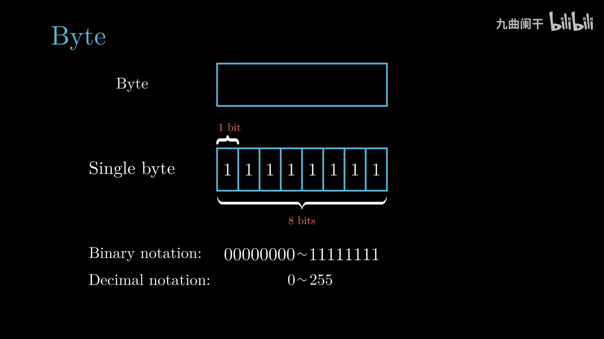
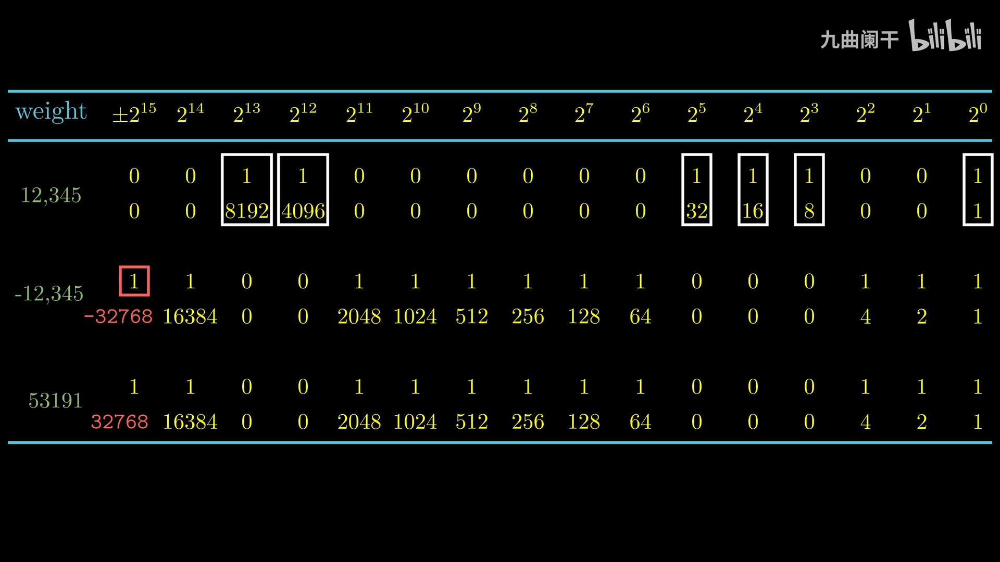
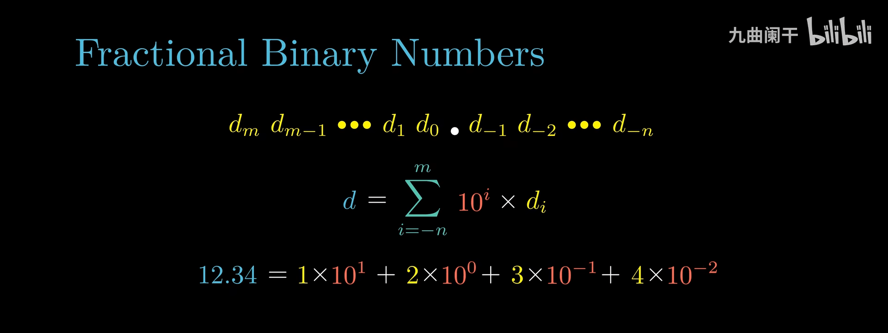
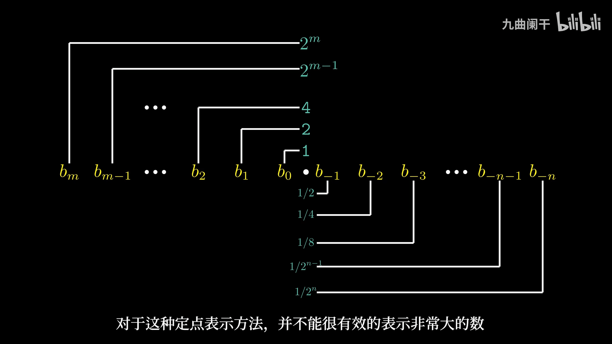

## 2.信息的表示和处理

### 信息的存储

通常情况下，程序将内存视为一个非常大的数组，数组的元素由一个个字节组成，每个字节都有唯一的数字表示，称为 Address(地址)，所有地址的集合就称为 Virtual Address Space(虚拟地址空间)

word size(字长): 决定了虚拟地址空间的大小，字长为 w 位的机器的虚拟地址空间 (程序使用连续的虚拟地址访问内存/磁盘) 的范围是 $0 \sim 2^{w} - 1$（因为每一个 bit 位有 0 和 1 两种取值）

- 32 位系统（如 x86）的虚拟地址空间最大为 4GB($2^{32}$ Byte)
- 64 位系统（如 x86_64）：理论上可支持 16EB（$2^{64}$ Byte），但实际操作系统通常不会完全使用。例如：
  - Linux 默认使用 48 位地址空间（256TB）。
  - Windows 也类似，通常使用 47-48 位地址。

大多数 64 位机器向后兼容，可以运行 32 位程序

32 位程序与 64 位程序的区别是编译过程，而不是运行机器的类型

在编译时可以通过编译选项指定生成 32 位的程序还是 64 位的程序

不同的数据类型可能占用不同的大小，同时对于不同位数的机器也有区别，很多数据类型都是占用了多个字节空间

> 对于需要存储的数据，我们需要知道「该数据的地址是什么」以及「数据在内存中是如何排布的」

Byte Ordering(字节序)：数据在内存中的排列形式，有大端法与小端法两种方式，区别在于高位地址的位置

- Big Endian(大端法): 高位有效字节存储在低地址处 (优先读取最高有效字节)，更符合人类直觉，适用于网络传输和存储
- Little Endian(小端法): 低位有效字节存储在低地址处 (优先读取最低有效字节)，适合计算机内部处理，主流 CPU 采用

| **字节序**        | **定义**         | **示例（0x12345678）** | **常见用途**                                                         |
| ----------------- | ---------------- | ---------------------- | -------------------------------------------------------------------- |
| **Big Endian**    | 高位字节存低地址 | `12 34 56 78`          | 网络通信（TCP/IP）、部分 RISC 处理器（PowerPC、SPARC）、部分文件格式 |
| **Little Endian** | 低位字节存低地址 | `78 56 34 12`          | x86、ARM 默认模式、Windows/Linux 处理                                |

32 位机器使用 4 字节地址，64 位机器使用 8 字节地址 (这对应了指针的占用大小)

字符串的表示：在 C 语言中，使用 NULL('\0') 作为一个字符串的结尾标识。比如要存储 "abcde"，虽然只有 5 个字符，但是长度却是 6

布尔代数：逻辑运算推理，如与 (and)、非 (or)、或 (not)、异或 (xor)

位级运算: 一个常见用途就是实现掩码运算

逻辑运算: 零表示 false，非零表示 true

移位运算: 左移在低位补 0 即可；右移分为逻辑右移与算术右移，Java 中的 `>>>` 专门提供了逻辑右移

- 逻辑右移：高位补 0
- 算数右移：高位补符号位（有符号数在进行右移时，需要使用算数右移）

### 整数 Integer

#### 整数的表示

计算机中对于有符号数的编码采用补码 (Two’s Complement) 的形式，最高位作为符号位

关于符号位，需要理解负权重的概念，而不能简单的当成一个负号

无符号数和有符号数的区别在于有没有最高位的符号位，以及由此带来的计算方式的不同。符号位中，0 标识了非负数，1 标识了负数（原因是最高位的负权重一定大于其余位的和）

#### 类型转换

对于 C 语言，在进行有符号和无符号数的互相转换时：

- 具体每一个字节的值不会改变，改变的是计算机解释当前值的方式
- 如果一个表达式既包含有符号数也包含无符号数，那么会被**隐式转换**成无符号数进行比较（这个隐式转换可能导致意想不到的问题）

> C 语言中的隐式类型转换可能会导致意想不到的问题，因此很多语言在编译时禁止了不同类型间的比较和运算，如 Go 语言

#### 类型扩展与截取

- 扩展（例如从 `short int` 到 `int`），保持数值不变是可以的，书中给出了数学证明
  - 无符号数：零扩展，在扩展的数位补 0
  - 有符号数：符号位扩展，在扩展的位数补符号位的数值（即最高位）
- 截取（例如 `unsigned int` 到 `unsigned short`），想要保持数据不变只有在小数据的情况下是可能的（原数本身在目标位宽内）
  - 无符号数：丢弃多出的高位，相当于取模运算
  - 有符号数：同样截断，再重新解释。
    - 如 -41，8 位的二进制表示是 `1101 0111`，在截取 4 位后，无法表示原数（因为 4 位补码可表示的范围是 –8 到 7）

> 当两个不同数据类型进行比较或者运算时，C 语言会自动做拓展（如果可以），把小的数据类型转换成大的

#### 正数加减法运算

- 溢出丢弃：如果两个 w 位的数字相加，结果是 w+1 位，则会丢弃最高位（实际上是做了一个取模操作）
  - 两个无符号数相加，可能因为溢出导致结果更小
  - 两个有符号数相加，操作和无符号数相同，只是解释时不同，分为正溢出和负溢出
    - 正溢出 (positive overflow)：数值太大，符号位的 0 变为了 1，导致解释为负数
      - 如 1 字节的有符号的 127 与 1 相加，期望得到 128，但最后得到了 -128
    - 负溢出 (negative overflow)：数值太小，符号位的 1 变为了 0，导致解释为正数
      - 如 1 字节的有符号的 -128 与 -1 相加，期望得到 -129，但最后得到了 127
- 溢出检测：C 语言中并不会对溢出进行报错
  - 两个无符号数相加：当发生溢出时得到的和一定小于任何一个数（推导见图）
  - 两个有符号数相加：
    - 两个正数相加，得到的结果为负，则说明发生了正溢出
    - 两个负数相加，得到的结果为正，则说明发生了负溢出
    - 注意：一正一负相加是不会溢出的

#### 正数乘除法运算

> [!todo] 这里没有详细看

乘法同加法运算一样，当溢出时会进行截断

乘法指令的执行需要多个时钟周期，很多 C 语言编译器试图用移位、加法以及减法代替整数乘法的操作

对于除以 2 的幂也可以用移位实现（无符号数使用逻辑右移，有符号数使用算数右移）

整数除法可能遇到除不尽的情况，统一 0 舍入

### 浮点数 Float

> [!todo] 这里没有详细看

#### 定点表示法

可以类似于 10 进制用一个统一的公式来表达：$\sum_{k = - j}^{i} b_{k} \times 2^{k}$

例如 $5 \frac{3}{4} = (101.11)_{2} , 2 \frac{7}{8} = (10.111)_{2} , 1 \frac{7}{16} = (1.0111)_{2}$

这种表达方式其实是比较明显的限制的，比如说，只有形为 $\frac{x}{2^{k}}$ 的小数部分可以被精确表示，其他的数字会变成循环的小数，例如：$\frac{1}{3} = 0.0101010101[01](\ldots)_{2}$。

除此之外，另一个问题在于，如果给定了 w 个比特，能够表达的数字其实是有限的，具体的原因会在后面详细解释。

#### IEEE 浮点数标准

## 参考资料

- [【读薄 CSAPP】壹 数据表示 - 小土刀](https://wdxtub.com/csapp/thin-csapp-1/2016/04/16/)
- [【CSAPP-深入理解计算机系统】2-1.信息的存储(上) - 九曲阑干](https://www.bilibili.com/video/BV1tV411U7N3)
- [【CSAPP-深入理解计算机系统】2-1.信息的存储(下) - 九曲阑干](https://www.bilibili.com/video/BV1DK4y1Y7Yi)
- [【CSAPP-深入理解计算机系统】2-2.整数的表示(上) - 九曲阑干](https://www.bilibili.com/video/BV1ba4y1E7qy)
- [【CSAPP-深入理解计算机系统】2-2.整数的表示(下) - 九曲阑干](https://www.bilibili.com/video/BV1HK411K7TX)
- [【CSAPP-深入理解计算机系统】2-3.整数的运算(上) - 九曲阑干](https://www.bilibili.com/video/BV13Z4y1V734/)
- [【CSAPP-深入理解计算机系统】2-3.整数的运算(下) - 九曲阑干](https://www.bilibili.com/video/BV1Ff4y1q7Kf/)
- [【CSAPP-深入理解计算机系统】2-4.浮点数(上) - 九曲阑干](https://www.bilibili.com/video/BV1VK4y1f7o6/)
- [【CSAPP-深入理解计算机系统】2-4.浮点数(下) - 九曲阑干](https://www.bilibili.com/video/BV1zK4y1j7Cn/)
