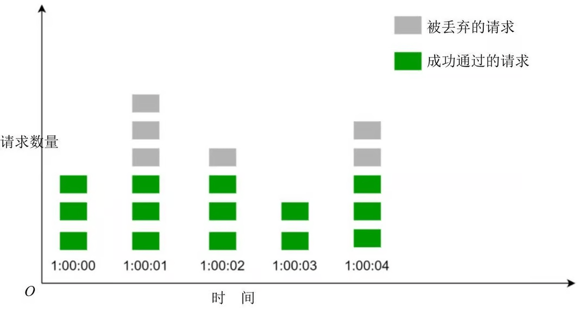
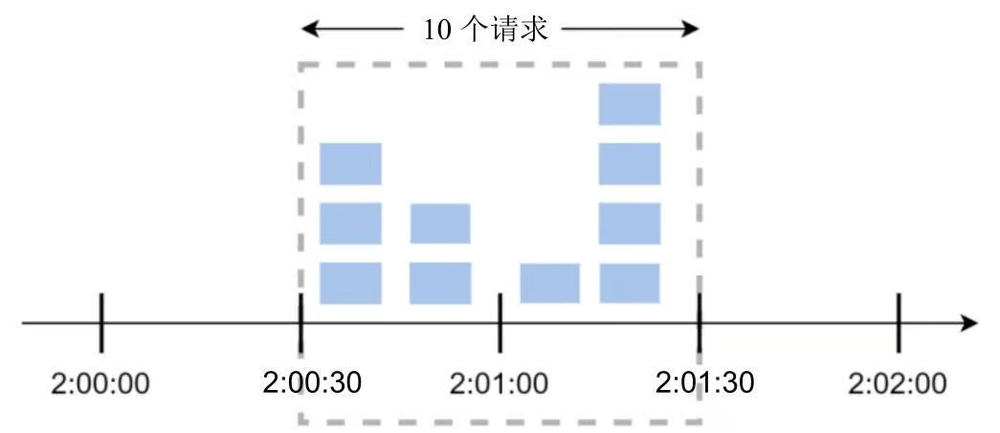
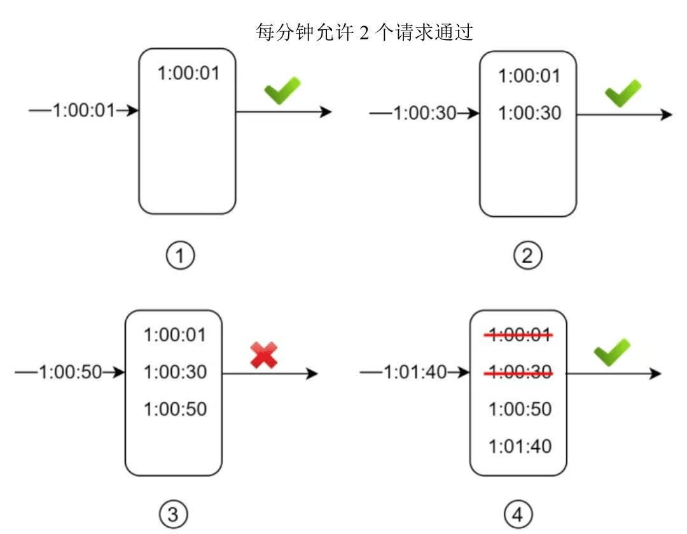
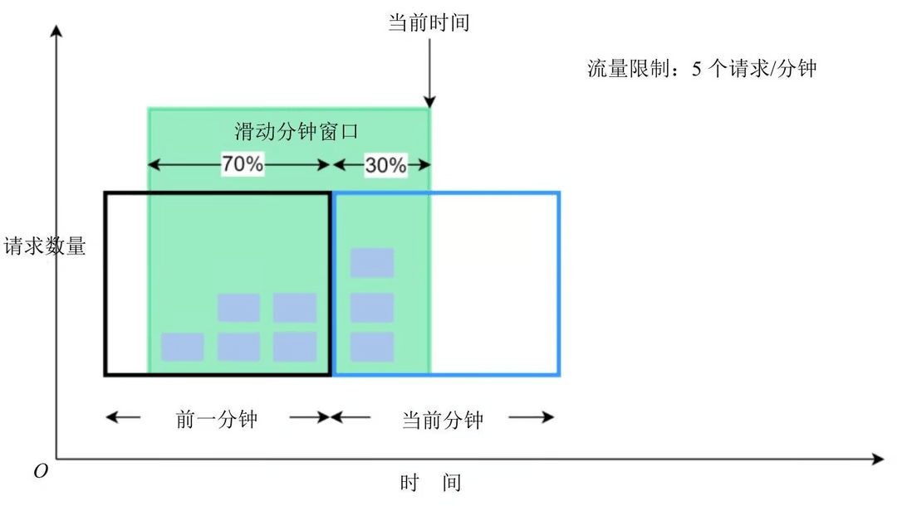
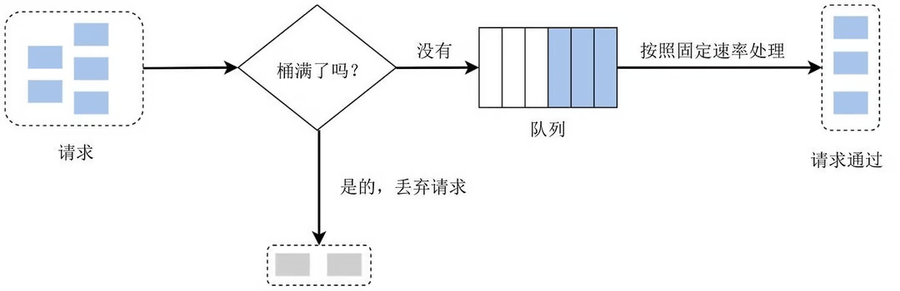
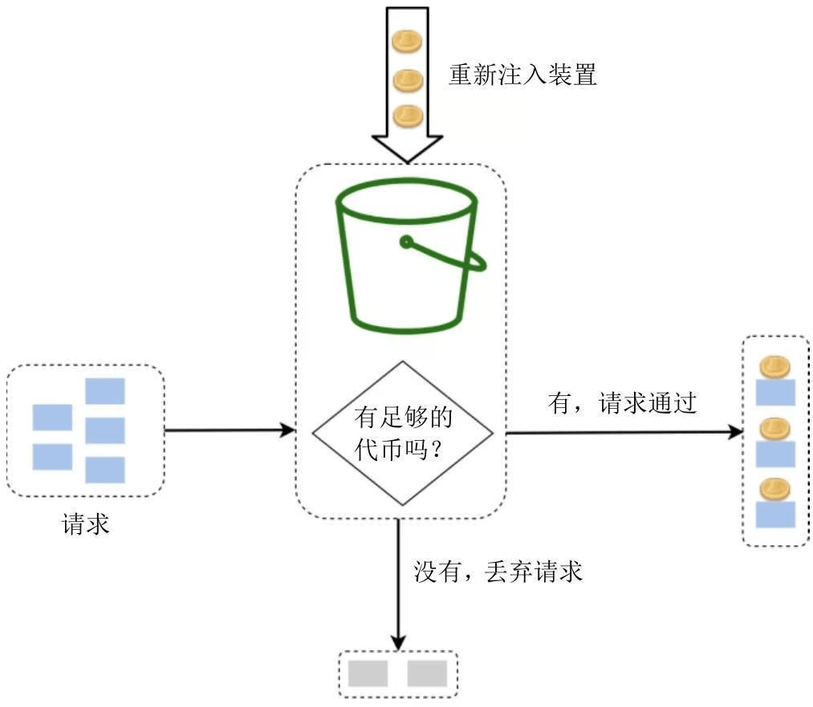

## 为什么需要限流

### 避免连锁崩溃

一个服务即便进行过压测，但当真实运行到线上时，其收到的请求流量以及能够负载的流量是不固定的，如果服务自身没有一个自我保护机制，当流量超过预计的负载后，会将这部分负载传递给该服务的下游，造成连锁反应甚至雪崩。

### 提供可靠的响应时间

服务调用方一般都设有超时时间，如果一个服务由于拥塞，导致响应时间都处于超时状态，那么即便服务最终正确提供了响应，对于 Client 来说也完全没有意义。

一个服务对于调用方提供的承诺既包含了响应的结果，也包含了响应的时间。限流能够让服务自身通过主动丢弃负载能力外的流量，以达到在额定负载能力下，依然能够维持有效的响应效率。

## 限流方案

### 固定窗口计数器（Fixed Window Counter）

- **原理**：在固定的时间窗口内，允许一定数量的请求通过。每当时间窗口结束时，计数器会重置。超出最大请求数的请求将被拒绝。
- **特点**：
- 容易受到时间窗口边界问题的影响（即在窗口切换时，可能会允许过多的请求通过）
- **适用场景**：适用于流量相对平稳的场景，通常在请求量较低的应用中使用。



具体来说，当大量请求在一个窗口的特别早或特别晚时，就会出现“突刺”现象。太早则窗口剩余时间无法处理；太晚则可能和下一个窗口的大量请求堆积，导致超出阈值。

例如在 1 分钟内，5 个请求都是在前 30s 过来的，那么后面的 30s 的请求都会被拒绝，而系统此时是空闲的。另外还有“临界问题”，如果 5 个请求是在后 30s 过来的，而下一个 1 分钟的 5 个请求在前 30s 过来，此时系统在这 1 分钟内就需要处理 200 个请求，跟我们想要的不符合。



```go
type FixedWindowCounter struct {
    mu        sync.Mutex
    requestCount int
    limit     int
    window    time.Duration
    resetTime time.Time
}

func NewFixedWindowCounter(limit int, window time.Duration) *FixedWindowCounter {
    return &FixedWindowCounter{
        limit: limit,
        window: window,
        resetTime: time.Now(),
    }
}

func (fw *FixedWindowCounter) Allow() bool {
    fw.mu.Lock()
    defer fw.mu.Unlock()

    now := time.Now()
    // 如果距离上次重置时间大于窗口值，则重置计数器
    if now.Sub(fw.resetTime) >= fw.window {
        fw.requestCount = 0
        fw.resetTime = now
    }

    if fw.requestCount < fw.limit {
        fw.requestCount++
        return true
    }
    return false
}
```

### 滑动窗口日志（Sliding Window Log）

- **原理**：每次请求都会在时间轴上记录，滑动窗口会随着时间的推移进行更新。
- **特点**：
	- 能够更加平滑地控制请求速率，避免固定窗口切换时的突发流量
	- 其消耗的内存过多，因为即使一个请求已被拒绝，它的时间戳依然被保存在内存中。
- **适用场景**：适用于需要精确限流的场景，减少边界效应。



```go
type SlidingWindowLog struct {
    mu        sync.Mutex
    events    *list.List // 双向链表
    limit     int
    window    time.Duration
}

func NewSlidingWindowLog(limit int, window time.Duration) *SlidingWindowLog {
    return &SlidingWindowLog{
        events: list.New(),
        limit: limit,
        window: window,
    }
}

func (sw *SlidingWindowLog) Allow() bool {
    sw.mu.Lock()
    defer sw.mu.Unlock()

    now := time.Now()
    // 清理过期的事件
    for sw.events.Len() > 0 {
		// 最早的请求超过了窗口则删除
        if sw.events.Front().Value.(time.Time).Add(sw.window).Before(now) {
            sw.events.Remove(sw.events.Front())
        } else {
            break
        }
    }

    if sw.events.Len() < sw.limit {
        sw.events.PushBack(now)
        return true
    }

    return false
}
```

### 滑动窗口计数器（Sliding Window Counter）

- **原理**：在滑动窗口日志的基础上进行修改，其中一种实现是「滑动窗口所允许的请求数量 = 当前窗口的请求数 + 之前窗口的请求数 × 滑动窗口和之前窗口的重合率」
- **特点**：
	- 它平滑了流量中的波动，因为当前时间窗口内请求的速率是基于前一个时间窗口内请求的平均速率计算出来的。
	- 减少了记录大量时间戳的内存消耗
	- 滑动窗口计数器算法的缺点是，它只对不那么严格的回溯窗口起作用。该算法只是对真实流量速率进行了近似估计，因为它假设前一个窗口中的请求是均匀分布的。尽管如此，这个问题可能并没有看起来那么严重。根据 Cloudflare 的实验，在 4 亿个请求中，只有 0.003% 的请求被错误地允许通过或被限流。
- **适用场景**：同滑动窗口日志



### 漏桶（Leaky Bucket）

- **原理**：类似于消息队列，使用一个桶来存储请求，当请求到达时，它们会依次进入桶中。如果桶没有满，水会以恒定的速率流出。如果桶已满，则新请求会被丢弃。
- **特点**：
	- 平滑的流量控制，能确保请求按照固定速率流出。
	- 不允许短时间内出现突发流量，所有的请求流量按固定速率流出。
- **适用场景**：适用于需要平滑流量、避免短时间内的突发请求影响系统的场景。



在实现时，并不一定需要真的存储请求，只需要记录「目前可用令牌数量」和「上一次访问时间」，当请求时，根据这两个变量计算出这个过程中的漏出的水的数量即可

```go
type LeakyBucket struct {
	mu       sync.Mutex
	capacity int
	water    int           // 当前水量
	rate     time.Duration // 漏水速度
	lastTime time.Time
}

func NewLeakyBucket(capacity int, rate time.Duration) *LeakyBucket {
	return &LeakyBucket{
		capacity: capacity,
		water:    0,
		rate:     rate,
		lastTime: time.Now(),
	}
}

func (lb *LeakyBucket) Allow() bool {
	lb.mu.Lock()
	defer lb.mu.Unlock()

	now := time.Now()
	elapsed := now.Sub(lb.lastTime)

	// 计算两次请求之间漏的水的数量
	lb.water = max(lb.water-int(elapsed/lb.rate), 0)
	lb.lastTime = now

	// 如果可以继续加水，则返回 true
	if lb.water < lb.capacity {
		lb.water++
		return true
	}

	return false
}
```

### 令牌桶（Token Bucket）

- **原理**：每个请求需要获取一个令牌。令牌会**以固定速率放入桶**中，**桶有最大容量**。如果桶满了，新的令牌将会丢弃。当请求到达时，若桶中有令牌，说明可以处理该请求，令牌被取走；若桶中没有令牌，则拒绝请求。
- **特点**：
	- 能够处理突发流量，因为桶中可以积累一定数量的令牌。
	- 适用于允许请求量有一定波动的场景。
- **适用场景**：适用于限流场景中需要允许短时间内的流量突增，例如某些高并发的 API 服务。



与漏桶类似，并不一定需要真的存储请求，只需要记录「目前可用令牌数量」和「上一次访问时间」，当请求时，根据这两个变量计算出这个过程中的增长的令牌数量即可

```go
type TokenBucket struct {
	mu       sync.Mutex
	capacity int
	tokens   int           // 当前可用令牌数
	rate     time.Duration // 令牌发放速度
	lastTime time.Time     // 上一次请求时间
}

func NewTokenBucket(capacity int, rate time.Duration) *TokenBucket {
	return &TokenBucket{
		capacity: capacity,
		tokens:   capacity,
		rate:     rate,
		lastTime: time.Now(),
	}
}

func (tb *TokenBucket) Allow() bool {
	tb.mu.Lock()
	defer tb.mu.Unlock()

	now := time.Now()
	elapsed := now.Sub(tb.lastTime)

	// 计算当前可用令牌数
	tb.tokens = min(tb.tokens+int(elapsed/tb.rate), tb.capacity)
	tb.lastTime = now

	// 如果有令牌，则允许访问，并扣除一个令牌
	if tb.tokens > 0 {
		tb.tokens--
		return true
	}

	return false
}
```

## 参考

- [RPC 漫谈： 限流问题 - joway](https://blog.joway.io/posts/deep-into-rpc-ratelimiter/)
