## 1.计算机系统漫游

为什么要了解编译系统是如何工作的？

-   优化程序性能
-   理解链接时出现的错误
-   避免安全漏洞

### HelloWorld 程序的一生简述

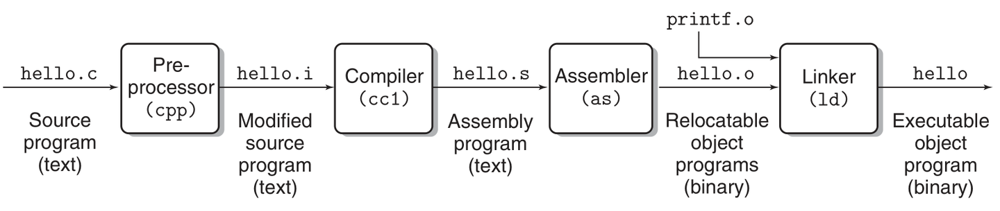

一个 C 语言程序（例如 `hello.c`）从编写到执行再到结束的整个生命周期

1. **编译过程**：
    - C 语言是一种高级语言，计算机无法直接理解。为了让计算机能够执行 C 语言程序，必须将其转换为机器语言。这一过程称为编译。
    - 编译过程涉及多个步骤：
        - **预处理**（cpp）：处理源代码中的预处理指令（如 `#include` 和 `#define`）。生成 `hello.i` 文件
        - **编译**（cc1）：将预处理后的代码转换为汇编语言。生成 `hello.s` 文件
        - **汇编**（as）：将汇编语言转换为机器语言（目标文件）。生成 `hello.o` 文件
        - **链接**（ld）：将目标文件与所需的库文件 (如 `printf.o`) 链接，生成最终的可执行文件。
2. **程序执行过程**：
    - 当用户在 shell 中运行可执行程序时，shell 会调用 `fork` 函数创建一个子进程。
    - 创建子进程后，操作系统使用 `execve` 函数来加载程序的可执行文件，并为其分配虚拟内存。
    - 程序开始执行，从 `main` 函数开始，执行相关代码（例如打印信息）。
3. **运行优化**：
    - 在程序运行过程中，操作系统使用多种机制（如 TLB、页表、缓存等）来提高程序的执行效率。
4. **程序结束与资源回收**：
    - 程序执行完成后，shell 会回收子进程，操作系统内核会删除与该进程相关的数据结构，并释放占用的资源。

### 计算机系统的硬件组成

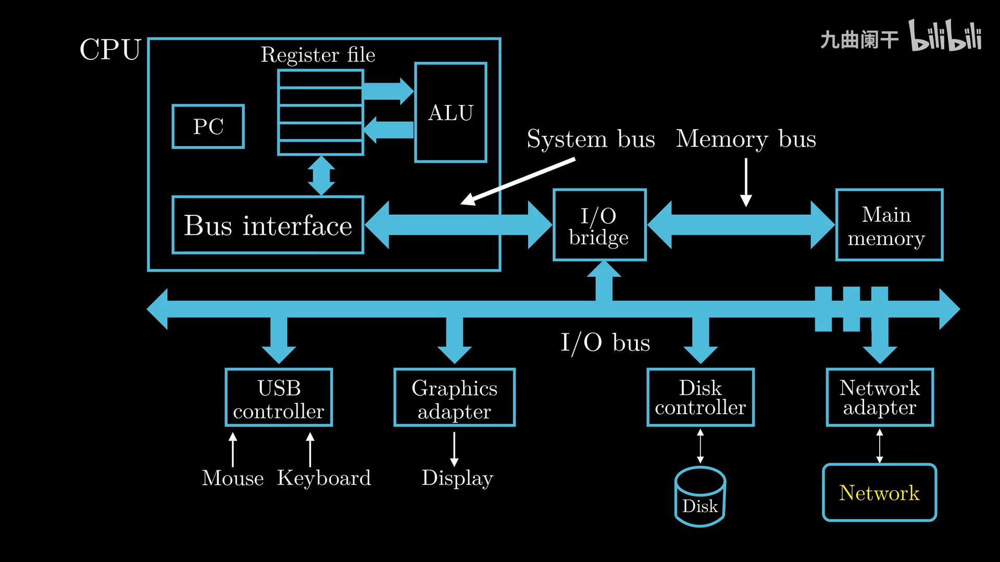

**CPU(Central Process Unit, 中央处理单元, 处理器)：**

-   **Program Count(PC, 程序计数器，指令指针)**：大小为一个 word(字) 的存储区域，存放某一条指令的地址
    -   CPU 从通电开始就在不断执行 PC 指向的指令，然后更新 PC 使其指向下一条要执行的指令（注意，下一条要执行的指令与刚刚执行的指令并不一定相邻）
-   **Register file(寄存器文件)**：CPU 中的一个存储设备，由单字长的寄存器组成
-   **Register(寄存器)**：临时存放数据的空间，保存计算结果，每个寄存器有自己唯一的名字
-   **ALU(Arithmetic Logic Unit, 算术逻辑单元)**：复制寄存器中保存的值执行算术运算，并保存到寄存器中
    -   以计算两个变量 a+b 的和为例：
        -   CPU 进行数据的加载：CPU 从内存中读取 a 的值暂存至寄存器 X 中，读取 B 的至暂存至寄存器 Y 中（这个操作会覆盖寄存器中原来的值）
        -   ALU 复制寄存器 X 和 Y 中保存的数值，进行算数运算，并保存到寄存器 X 或 Y 中
-   **Main Memory(主存, 内存)**：CPU 在执行程序时，内存主要存放程序的指令及数据，由 RAM(随机访问存储器) 组成，可以看作一个从 0 开始的数组，每个字节都有相应的地址
-   **Bus(总线)**：负责将信息从一个部件传递到另一个部件，通常总线被设计成传送固定长度的字节块，也就是 word(字)
-   **输入输出设备**：如鼠标、键盘、显示器、磁盘等，通过控制器或适配器与 IO 总线相连。

> 对于 字长 (word size) 为 32 位的机器 1word = 4Byte
> 对于 字长为 64 位的机器 1word = 8Byte

通过 shell 执行一个编译好的 hello 可执行文件（打印 `Hello World`）理解：

1. 键盘输入 `./hello` 字符串
2. shell 将输入字符逐一读入 CPU 中的寄存器
    - 键盘 -> USB 控制器 -> IO 总线 -> IO Bridge -> ... -> 寄存器
3. CPU 确定存储的内存位置并将其放入内存中
    - 寄存器 -> ... -> IO Bridge -> ... -> 内存
4. CPU 将 hello 中的数据和代码从磁盘复制到内存，利用 DMA(Direct Memory Access) 技术，数据不经过 CPU 直接到达内存
5. CPU 执行代码
6. CPU 将 `Hello World\n` 字符串从内存复制到寄存器文件，再从寄存器复制到显示设备

数据需要在多个地方（磁盘、内存、处理器、IO 设备）之间搬运，系统设计人员的一个主要任务就是缩短信息搬运所花费的时间

通常情况下：

-   大容量的存储设备的存取速度比小容量的慢
-   运行速度更快的设备的价格相对于低速设备更贵

由于存储设备的容量、速度与价格，为了提高字的传递速度，设计了**多级缓存**，其主要思想就是「**上一层存储设备是下一层存储设备的高速缓存**」

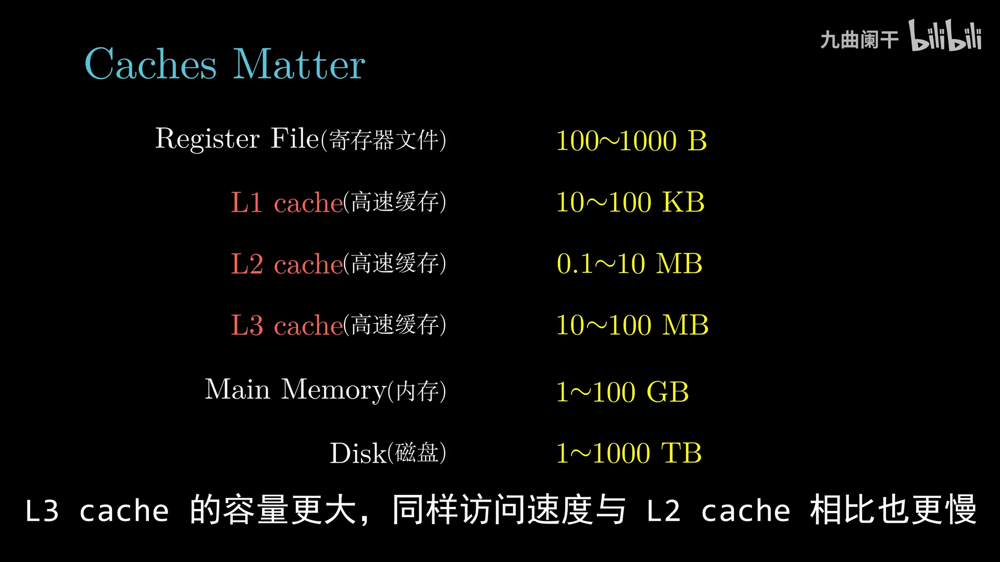
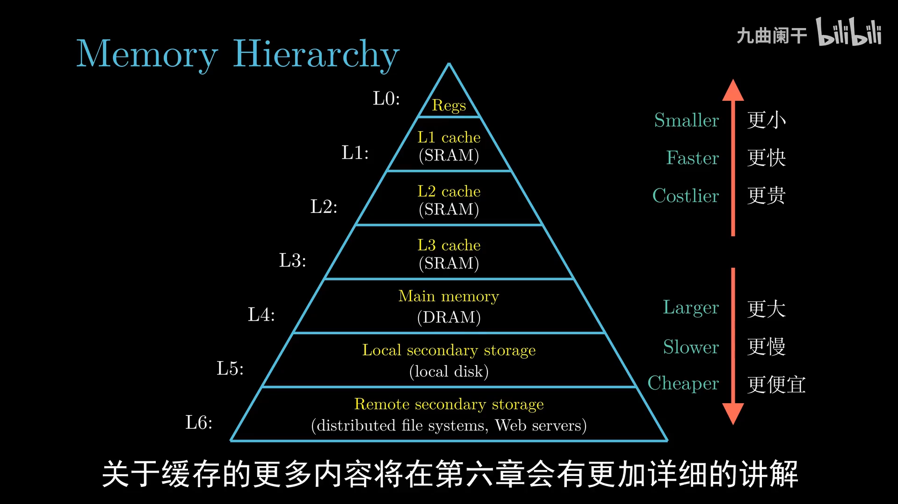

### 操作系统

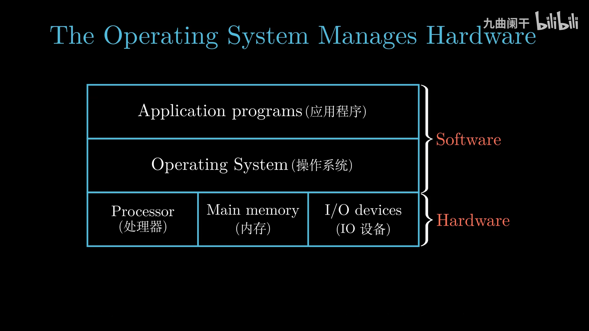

Operating System(OS，操作系统)：是 Application Program(应用程序) 与 Hardware(硬件) 之间的中间层，所有应用程序对硬件的操作必须通过操作系统完成

-   防止应用程序滥用硬件
-   提供统一的机制（如进程，虚拟内存，文件）控制复杂的底层硬件（计算机的层层抽象）
    -   文件是对 IO 设备的抽象
    -   虚拟内存是对内存和磁盘 IO 的抽象
    -   进程是对处理器、内存以及 IO 设备的抽象

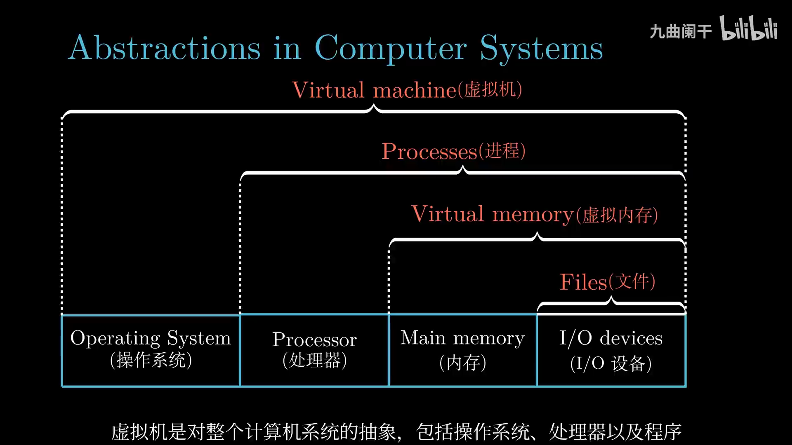

#### 进程

[Program(程序)](<https://en.wikipedia.org/wiki/Program_(machine)>): 指令、数据及其组织形式的描述

[Process(进程)](<https://en.wikipedia.org/wiki/Process_(computing)>): 程序执行的实例，即程序进行时，是系统资源分配的基本单位

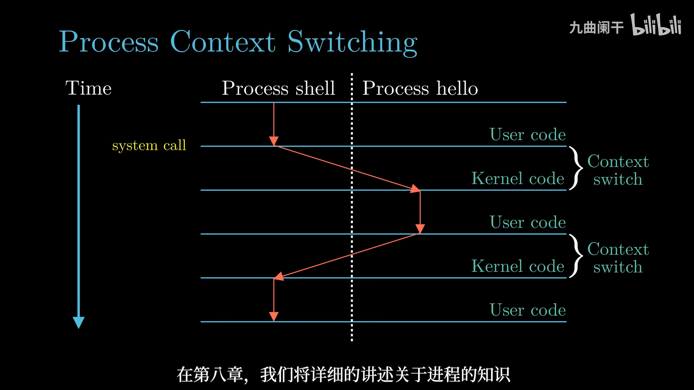

通过 shell 执行 hello 程序理解：

1. shell 进程等待用户输入
2. shell 进程通过系统调用执行请求
    1. 将控制权从 shell 进程传递给操作系统
    2. 保存 shell 进程的上下文
    3. 创建一个新的 hello 进程及其上下文
3. hello 进程执行完后，操作系统恢复 shell 进程的上下文，并将控制权交给 shell 进程
4. shell 进程继续等待下一个用户输入

> Process Context(进程上下文): 进程运行中所需要的所有状态信息，如 当前 PC、寄存器的值、内存中的内容 等

#### 线程

[Thread(线程)](<https://en.wikipedia.org/wiki/Thread_(computing)>): CPU 调度和执行的基本单位

一个进程由多个线程组成，每个线程都运行在进程的上下文中，共享代码和数据

#### 虚拟内存

[Virtual Memory(虚拟内存)](https://zh.wikipedia.org/zh-cn/%E8%99%9A%E6%8B%9F%E5%86%85%E5%AD%98): 计算机系统内存管理的一种技术，它使得应用程序认为它拥有连续可用的内存（虚拟地址空间），并提供了内存安全，进程间隔离等功能

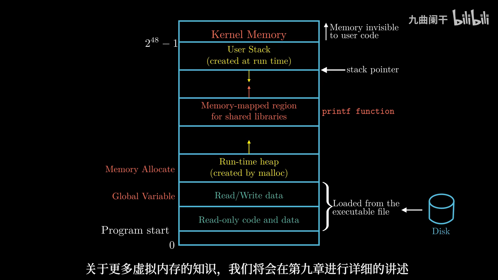
从下向上看，地址是增大的，最下面是 0 地址

现代操作系统通常将 **用户空间（User Space）** 和 **内核空间（Kernel Space）** 分开

虚拟地址空间的典型布局（以 x86_64 Linux 为例）

-   **用户空间（User Space）**
    -   **从 0x0000000000000000 到 0x00007FFFFFFFFFFF**（Linux x86_64 默认前 128TB）
    -   主要包括：
        1.  **代码段（.text）**：存储程序的可执行代码，通常是 **只读的**。
        2.  **数据段（.data/.bss）**：从可执行目标文件中加载而来
            -   **.data**：已初始化的全局和静态变量。
            -   **.bss**：未初始化的全局和静态变量。
        3.  **堆（Heap）**：
            -   由 `malloc()`、`new` 分配，向高地址扩展。
        4.  **共享库（Shared Libraries）**：
            -   `libc.so` 等动态链接库（如 `printf` 函数），通常加载在中间地址范围（如 0x7Fxxxx）。
        5.  **栈（Stack）**：
            -   用于局部变量、函数调用等，**向低地址扩展**。
        6.  **内存映射区（Memory-Mapped Files & Anonymous Mapping）**：
            -   `mmap()` 分配的区域，如共享内存、映射文件等。
-   **内核空间（Kernel Space）**
    -   **从 0xFFFF800000000000 到 0xFFFFFFFFFFFFFFFF**（Linux x86_64 默认 128TB）
    -   仅 **操作系统内核** 可访问，通常包括：
        -   内核代码和数据
        -   设备驱动程序
        -   内存管理数据结构（页表等）
        -   物理地址映射（如 `ioremap()`）

#### 文件

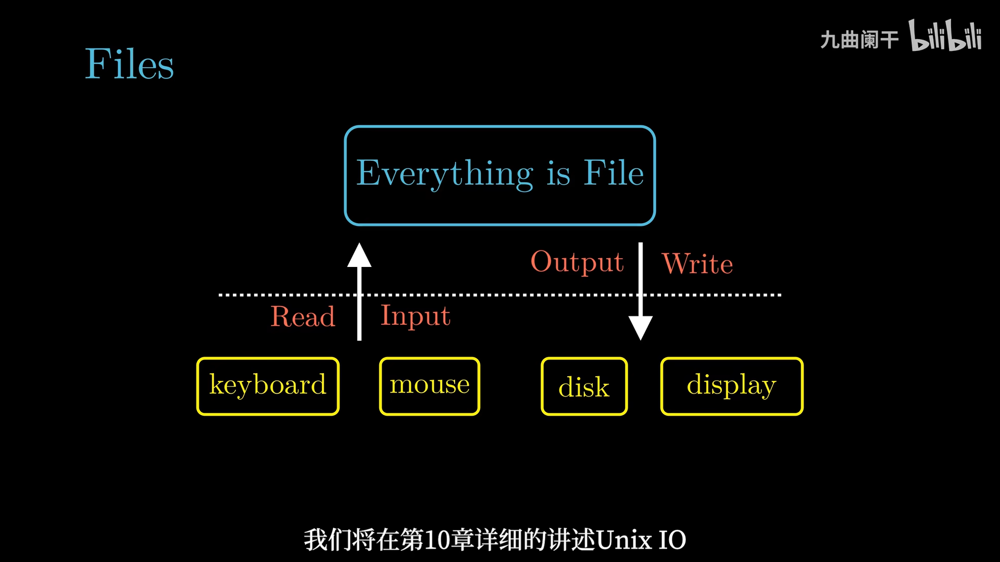
Unix 哲学: 一切皆文件，所有的 IO 设备（包括键盘、磁盘、显示器、网络等）都可以看成文件，系统中所有的输入输出都可以通过读写文件完成

### 网络

CS 编程模型: Client <=> Service <=> Database

现代通常使用 ssh 的方式连接远程主机

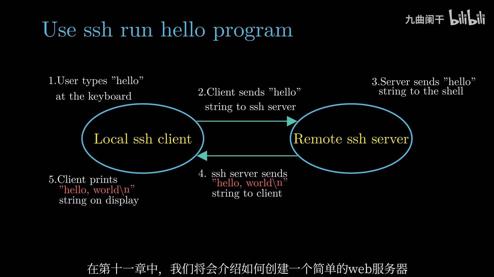

### 并发计算

[Amdahl's Law(阿姆达尔定律)](https://zh.wikipedia.org/zh-cn/%E9%98%BF%E5%A7%86%E8%BE%BE%E5%B0%94%E5%AE%9A%E5%BE%8B): 描述 CPU 并行计算效率提升的能力，即加速比

如何获得更高的计算能力 -> Concurrency and Parallelism(并发性与并行性):

-   Thread-Level Concurrency(线程级并发)
-   Instruction-Level Parallelism(指令级并行)
-   Single-Instruction Multiple-Data Parallelism(单指令 多数据 并行)

#### 线程级并发

Thread-Level Concurrency(线程级并发): 线程是 CPU 调度的基本单位，通过执行多个线程实现并发

多核处理器组织结构

-   每个 CPU 核心都有自己的 L1 Cache 和 L2 Cache
-   多个 CPU 核心共享 L3 Cache
-   多个 CPU 核心集成在一颗芯片上

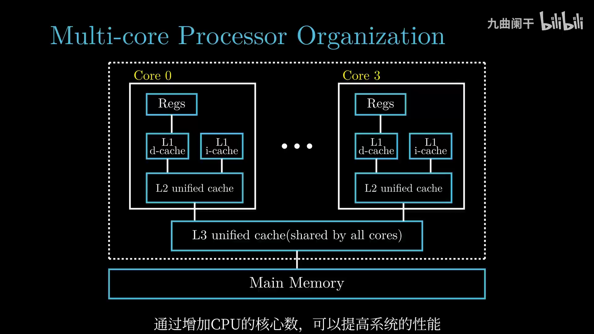

Hyperthreading(超线程、同时多线程): 一个 CPU 核心执行多个线程。通过在每个物理核心内部创建多个逻辑线程，使得核心在执行指令时可以同时处理来自两个或更多线程的任务。
工作原理：

-   **资源共享**：物理核心内的执行单元（如算术逻辑单元、浮点单元、缓存、总线等）在多个逻辑线程之间共享，但每个逻辑线程拥有独立的寄存器和程序计数器等部件。
-   **提高资源利用率**：在传统单线程执行中，当某个线程因数据依赖、缓存未命中或等待内存访问等原因导致部分执行单元闲置时，超线程技术允许另一个线程利用这些空闲资源，从而提高整体计算效率。

> IO 慢，CPU 计算快，CPU 在等待读取数据时通过线程切换执行其他线程

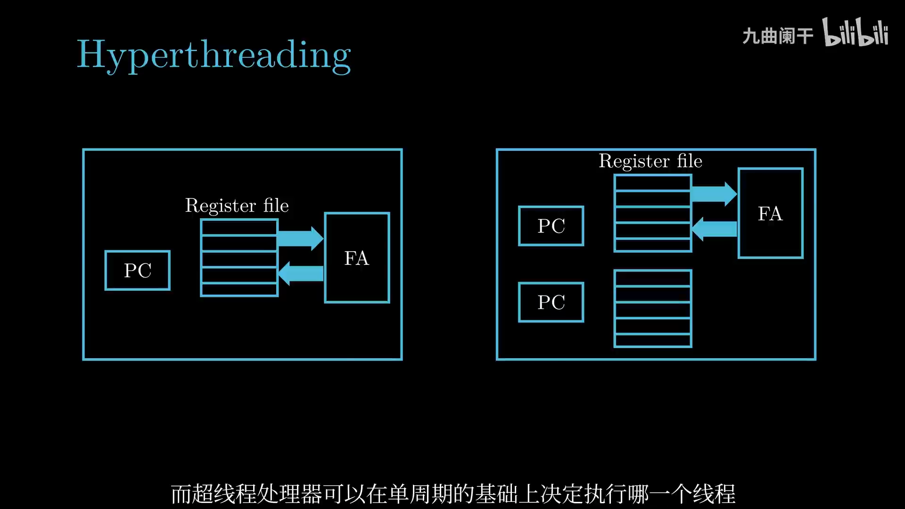

简单对比：

-   **超线程技术**：通过在单个物理核心上同时执行多个逻辑线程，改善了资源利用率和多任务并行处理能力，尤其在存在内存延迟和 I/O 等瓶颈时能有效隐藏等待时间，但在纯计算密集型任务中由于资源竞争，性能提升有限，同时需要处理线程间的资源竞争和同步问题。
-   **单线程技术**：每个核心仅处理一个线程，虽然在资源利用上可能出现浪费，但在不需要等待其他资源时能充分发挥核心的全部计算能力。

#### 指令级并行

Instruction-Level Parallelism(指令级并行): 同时执行多条指令

实现技术：

-   Pipelinin(流水线)
    -   将指令执行过程分为多个连续的阶段（如取指、译码、执行、访存、写回），每个阶段由不同的硬件模块负责。多条指令在不同阶段上“并行”运行，相当于生产线上的各个工序同时工作。
-   分支预测
    -   现代处理器通过预测程序中的分支走向，提前加载并执行可能需要用到的指令。如果预测正确，能大幅减少因分支判断导致的延迟；如果预测错误，处理器会回滚错误的投机执行结果。
-   ...

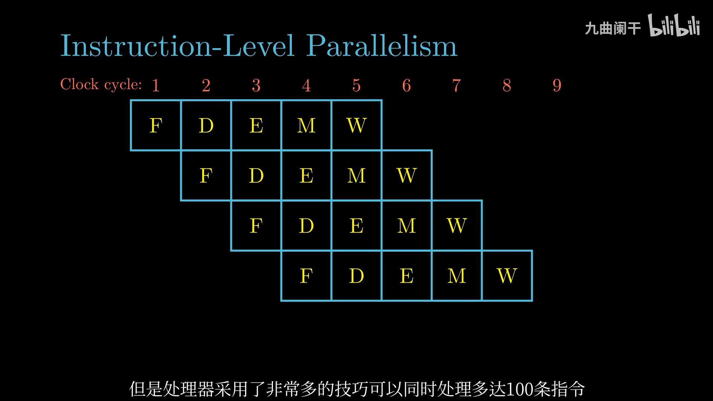

#### 单指令 - 多数据

SIMD(Single Instruction Multiple Data，单指令多数据): 单指令产生多个并行操作 (处理声音、视频)

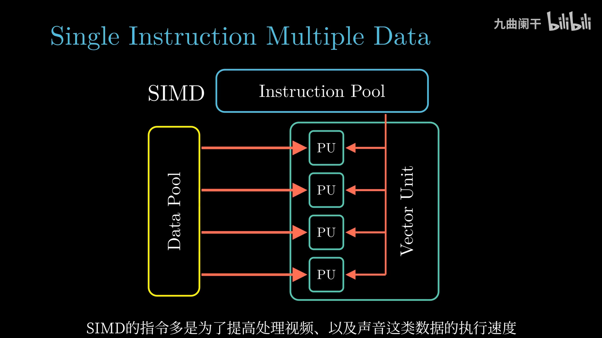

## Reference

- [计算机系统漫游：HelloWorld 的一生 - 潜龙勿用](https://zhuanlan.zhihu.com/p/513307151)
- [【CSAPP-深入理解计算机系统】1-1.计算机系统漫游 - 九曲阑干](https://www.bilibili.com/video/BV1cD4y1D7uR/)
- [【CSAPP-深入理解计算机系统】1-2.计算机系统漫游 - 九曲阑干](https://www.bilibili.com/video/BV115411h72j/)
- [【CSAPP-深入理解计算机系统】1-3.计算机系统漫游 - 九曲阑干](https://www.bilibili.com/video/BV1mi4y137g8/)
- [【CSAPP-深入理解计算机系统】1-4.计算机系统漫游 - 九曲阑干](https://www.bilibili.com/video/BV1MC4y1t77F/)
